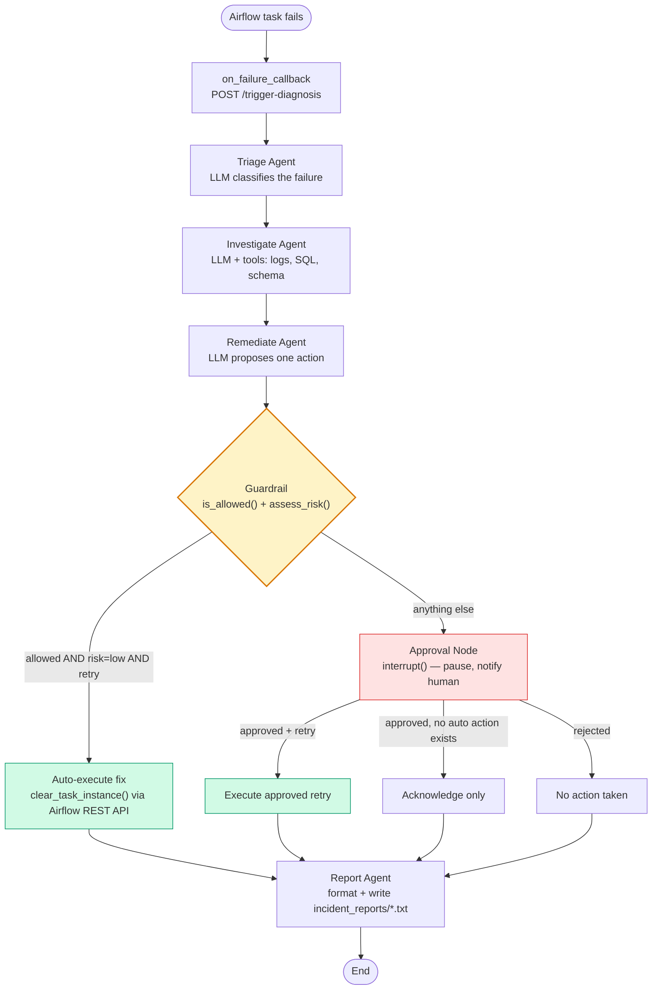

# Self-Healing Data Pipeline Agent

A multi-agent system that watches an Apache Airflow pipeline, diagnoses task
failures with an LLM, and either fixes them automatically or hands the
decision to a human — depending on a deterministic safety layer, not on the
LLM's own judgment.

## Why this exists

A handful of failure patterns account for most on-call time: an upstream API
timing out, a bad load producing unexpected nulls, a schema change breaking
a downstream query. Reading the same logs and running the same fix for the
tenth time isn't where an engineer's judgment adds value — the value is in
deciding *when it's safe to skip that step*. This project draws that line
explicitly: an LLM investigates and proposes a fix, but a separate, ordinary
Python function — not a model — decides whether that fix is allowed to run
without a person looking at it.

## Architecture



Every node except Report is a real LLM call with a specific job: Triage
classifies the failure into a category, Investigate uses tool-calling (log
retrieval, schema inspection, read-only SQL) to confirm or correct that
category with actual evidence, Remediate proposes one action. Report is not
an LLM call — it just formats what's already in state into a human-readable
record.

## The guardrail

This is the actual point of the project, not a side detail. `remediate_agent`
gets a proposal from the LLM (`action_type`, one of `retry` or `escalate`,
plus a justification), and then two plain functions decide what happens to
that proposal:

- `guardrails/allowlist.py` — `is_allowed(triage_category, action_type,
  try_number)` checks a static allow-list keyed by failure category (only
  `upstream_timeout` failures are allowed to auto-retry) and a retry-count
  ceiling (`MAX_AUTO_RETRIES`), so a flaky task can't retry forever.
- `guardrails/risk_classifier.py` — `assess_risk(action_type)` assigns a risk
  tier; any action type it doesn't explicitly recognize defaults to `high`,
  so a new action type the LLM invents on its own can't accidentally
  auto-execute just because nobody wrote a rule against it yet.

Only when the action is on the allow-list, its risk is `low`, and the action
is specifically `retry` does the system call Airflow's REST API to clear the
task instance and retry it. Schema drift and data-quality issues are never
on the allow-list, so no matter how confidently the LLM argues for a fix,
there's no code path that lets it run one automatically — it always reaches
a human, via LangGraph's `interrupt()` / `Command(resume=...)`, with state
checkpointed in Postgres so approval can come hours later without losing
context.

## Tech stack

- **Orchestration:** Apache Airflow (LocalExecutor, Docker Compose)
- **Agent framework:** LangGraph — `StateGraph`, `PostgresSaver` checkpointing,
  `interrupt()`/`Command(resume=...)` for human-in-the-loop
- **LLM:** Google Gemini (`gemini-3.x` family) via `langchain-google-genai`,
  structured output via Pydantic (`with_structured_output`)
- **Tool-calling:** LangChain `@tool` — log retrieval, SQL queries, schema
  inspection, via a manual ReAct-style loop (not a prebuilt agent executor)
- **API/UI:** FastAPI — serves the trigger/approve endpoints and a small
  vanilla-JS approval page from the same service
- **Database:** PostgreSQL, two roles with different privileges — an `agent`
  role (owns the checkpoint DB) and a read-only `investigator_ro` role (used
  only by the SQL tool, with query-level keyword filtering and session-level
  read-only mode as additional layers on top of the role's own grants)
- **Tests:** pytest + `unittest.mock`

## Repo layout

```
agents/          triage_agent.py, investigate.py, remediate.py, report.py,
                 graph.py (LangGraph wiring), state.py (AgentState)
guardrails/      allowlist.py, risk_classifier.py
tools/           airflow_api.py, sql_tool.py, log_tool.py
dags/            three failure-injection DAGs + db_conn.py + failure_listener.py
tests/           test_guardrails.py, test_graph_routing.py, test_remediate.py,
                 test_report.py
service.py       FastAPI app: /trigger-diagnosis, /approve, /reject,
                 /pending-approvals, and the approval UI
docker-compose.yaml, init-db/
```

## Setup

```bash
git clone <your-repo-url>
cd <repo>

cp .env.example .env   # fill in GOOGLE_API_KEY and DB credentials

docker compose up -d   # Airflow (localhost:8080) + Postgres

pip install -r requirements.txt

python -m pytest tests/ -v   # confirm guardrail/routing logic before touching real infra

uvicorn service:app --reload   # agent service on localhost:8000
```

Then, in the Airflow UI (`localhost:8080`):
1. Unpause one of the failure-injection DAGs.
2. Set the matching Airflow Variable to `true` to arm the failure.
3. Trigger a run.
4. Open `localhost:8000` to watch it either self-heal automatically or show
   up as a pending approval.

`.env` needs at minimum:
```
GOOGLE_API_KEY=...
TRIAGE_MODEL=gemini-3.1-flash-lite
INVESTIGATE_MODEL=gemini-3.5-flash-lite
REMEDIATE_MODEL=gemini-3.5-flash-lite
AGENT_DB_HOST_PORT=5432
AGENT_DB_NAME=pipeline_agent
AGENT_DB_USER=agent
AGENT_DB_PASSWORD=agent
```
(Triage, Investigate, and Remediate deliberately use different model names —
Gemini's free tier quotas are per-model, so one busy agent doesn't starve the
others. Match the investigator-role DB variables above to whatever names your
`tools/sql_tool.py` actually reads, if they differ.)

## Failure scenarios included

- `upstream_timeout_pipeline` — a transient upstream timeout; the only
  scenario that's allowed to auto-retry.
- `schema_drift_dag` — a column is missing from the source table; always
  escalates, no automatic fix exists for a broken schema assumption.
- `null_spike_dag` — unexpected NULLs land in a load; always escalates.

## Known limitations

- `pending_approvals` in `service.py` is an in-memory dict. Restarting the
  service loses track of which runs are paused, even though the LangGraph
  checkpointer in Postgres still holds the real state — the UI just can't
  see it until a new failure creates a new entry.
- The Airflow REST calls and the SQL tool both assume local Docker ports
  with no auth beyond the database role separation; this is a local dev
  setup, not a deployed one.

## See also

`DECISIONS.md` — the specific bugs found while building this (a Postgres ACL
gotcha, a docstring that silently ate the routing logic, a Gemini response
shape that broke the approval UI, and others), with root cause and fix for
each.
